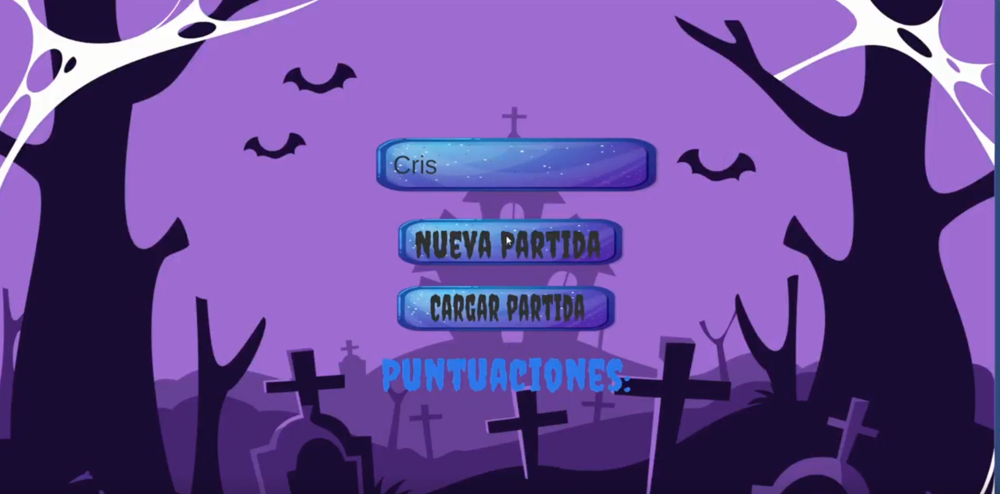
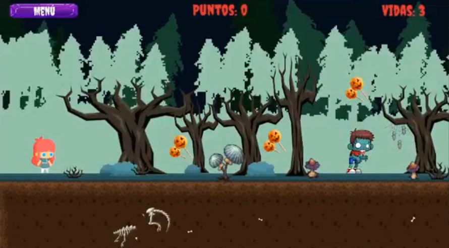
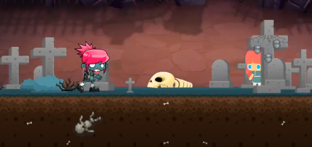
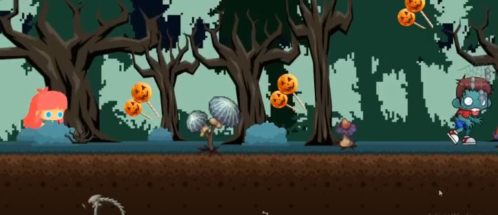

# 🎃 Halloween Platformer

Videojuego 2D de plataformas con temática de Halloween desarrollado en Unity.

La niña debe sobrevivir atravesando escenarios llenos de zombis,
recolectando caramelos para ganar puntos y vidas extra, y llegando
al final de cada pantalla sin perder todas sus vidas. !Está atrapada en una de sus pesadillas!

---

## 🕹️ Cómo se juega

- **Moverse:** flechas / WASD
- **Saltar:** Space
- Recoge caramelos y objetos para sumar puntos y vidas
- Evita o salta sobre los zombis — si te tocan, pierdes una vida
- Si pierdes todas las vidas, game over

---

## ✅ Características

- Menú principal con campo de nombre, nueva partida y cargar partida
- Sistema de puntuación guardado con PlayerPrefs
- Ranking de jugadores ordenado por puntuación
- 4 pantallas jugables con temática de bosque y cementerio
- Checkpoints: al perder una vida vuelves al último checkpoint alcanzado
- Guardado de partida (vidas, puntos, posición)
- Dos tipos de enemigos:
  - 🧟 Zombi perseguidor (sigue al jugador)
  - 🪲 Enemigo con ruta fija (patrulla una zona)
- Cámara que sigue al personaje
- Objetos coleccionables (caramelos, manzanas de caramelo,etc.)
- Assets, sprites, animaciones y audio incluidos

---

## 📸 Capturas

| Menú principal | Bosque | Cementerio | Capas
|---|---|---|
|  
*Main menu*

  
*Forest level*

 

*Cemetery level*

 

*Sorting layers in action*

---

## 🛠️ Tecnologías

- Unity 2D
- C#
- PlayerPrefs para guardado de datos

---

## 🎓 Contexto académico

Proyecto final del módulo de **Programación Multimedia y Dispositivos Móviles (PMDM) de GS DAM**.
